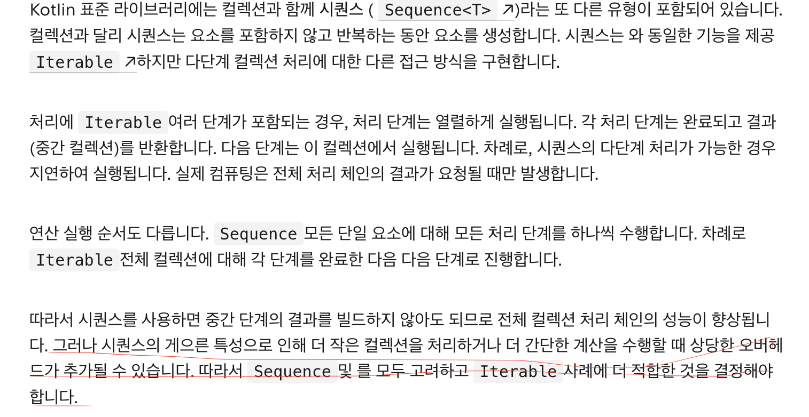
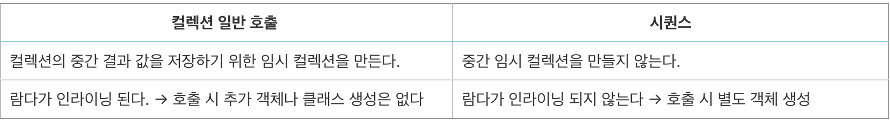

# Kotlin Collection 연산 

자바 에서는 stream()을 명시해 주고 그 아래부터 메소드들을 체이닝 하여 사용할 수 있습니다. 하지만 코틀린 에서는 Collection API를 지원하여 자바와는 stream()을 명시하지 않아도 바로 메소드들을 체이닝하여 사용할 수 있습니다. 

```kotlin
// java 
List<Inbound> inbounds = new ArrayList<>();

inbounds.stream()
    .map(...)
    .filter(...)
    .collect(Collectors.toList());

// kotlin
val inbounds : List<Inbound> = mutableListOf()

inbounds
.map(...)
.filter(...)
```

이 2가지 방식에는 차이가 존재합니다. 

- 자바의 Stream : Lazy evaluation (지연 연산)
- 코틀린의 Collections : Eager evaluation (즉시 연산)

Lazy는 지연연산 즉 연산 작업을 필요할 때 까지 최대한 후순위로 미룬 후 필요할 때 연산을 작업하는 방식이고, 

Eager는 연산 작업을 바로바로 작업하는 방식 입니다. 

아래와 같은 코드를 실행 했을 때 결과는 어떻게 될까요 ? 

```kotlin
// Lazy
val numbers = listOf(1, 2, 3, 4, 5)

numbers
    .stream()
    .map {
        println("Mapping: $it")
        it * 2
    }
    .filter {
        println("Filtering: $it")
        it > 5
    }
    .collect(Collectors.toList())

// Eager 
val numbers = listOf(1, 2, 3, 4, 5)

numbers
    .map {
        println("Mapping: $it")
        it * 2
    }
    .filter {
        println("Filtering: $it")
        it > 5
    }

```

결과 

```kotlin
// Lazy
Mapping: 1
Filtering: 2
Mapping: 2
Filtering: 4
Mapping: 3
Filtering: 6
Mapping: 4
Filtering: 8
Mapping: 5
Filtering: 10

// Eager 
Mapping: 1
Mapping: 2
Mapping: 3
Mapping: 4
Mapping: 5
Filtering: 2
Filtering: 4
Filtering: 6
Filtering: 8
Filtering: 10

```

결과를 보면 Lazy 연산 은 하나의 요소 요소에 대해 바로 map → filter 연산을 수행하고 
Eager 연산은 각 요소에 대해 모두 map연산을 수행 후 filter 연산을 수행하였습니다. 

Lazy 연산은 한 리스트 요소 요소에대해 조건에 부합하면 바로 다음 체이닝 되어진 filter 연산을 수행하였고, Eager 연산은 첫번째로 체이닝 되어진 map 연산을 모두 수행한 이후 그다음 filter연산을 수행하였습니다. 

그렇다면 Lazy 연산은 리스트의 요소들에 대해 반복을 하면서 바로바로 result에 저장이 되어지고, Eager 연산은 map 연산을 모두 마친 이후에 filter 연산을 한다는 말인데 map 연산을 한 데이터 값들을 어딘가에 임시로 저장해 두어야 한다는 소리 입니다. 그럼 메모리 효율을 생각해 보았을 때 데이터가 많으면 많을 수록 Lazy 연산이 이점을 가진다는 결론이 나옵니다.

그렇다면 Kotlin 에서 Lazy 연산을 하는 방법은 없을까요 ? 는 있습니다. `*asSequence` 를 사용하는 방법 입니다.* 

```kotlin
val numbers = listOf(1, 2, 3, 4, 5)

val result = numbers
    .asSequence()
    .map {
        println("Mapping: $it")
        it * 2
    }
    .filter {
        println("Filtering: $it")
        it > 5
    }
    .toList()

println(result)

// 결과 
Mapping: 1
Filtering: 2
Mapping: 2
Filtering: 4
Mapping: 3
Filtering: 6
Mapping: 4
Filtering: 8
Mapping: 5
Filtering: 10
[6, 8, 10]
```

그렇다면 또 항상 asSequence를 사용하여 Lazy 연산을 해야할까요 ? 

Lazy 연산 에 대해 좀더 설명하면 **중간 단계** 의 결과를 바로 리턴하냐 아니냐의 차이에 있습니다. Collections 은 매 연산을 수행할 때마다 결과 Collection 을 반환합니다.이에 비해 Sequences는 종료 (terminate) 함수가 호출되기 전까지는 연산을 수행하지 않습니다.위에서 사용한 `toList()` 함수 또한 종료 함수입니다. 이 차이를 쉽게 알려면 종료 함수가 없는 Sequences 를 사용해보면 됩니다.

```kotlin
val numbers = listOf(1, 2, 3, 4, 5)

val result = numbers
    .asSequence()
    .map {
        println("Mapping: $it")
        it * 2
    }
    .filter {
        println("Filtering: $it")
        it > 5
    }

println("종료함수 호출 하기 전")
result.toList()
```

위 코드의 결과는 어떻게 될까요 ? 

```kotlin
// 결과 
종료함수 호출 하기 전
Mapping: 1
Filtering: 2
Mapping: 2
Filtering: 4
Mapping: 3
Filtering: 6
Mapping: 4
Filtering: 8
Mapping: 5
Filtering: 10
```

Sequence 는 매 함수의 결과로 `Sequence` 를 반환합니다. 그래서 최종적으로 Collection 으로 변환하려면 다시 `toList()` 를 호출해야 합니다. `toList()` 역시 종료함수라서 호출되는 순간에 모든 연산이 수행됩니다.

Sequences 와 다르게 Collections 은 매 함수의 결과로 `Collection` 을 반환합니다. 사실상 매 함수가 모두 종료 함수라고 볼 수 있으며, 그래서 결과를 다음 단계로 넘기지 못하고 매번 전부 연산을 하는겁니다.

### **결론적으로 무슨 차이가 있는가?**

- `Sequence`는 **Lazy 연산**을 통해 각 요소가 필요할 때만 연산을 수행하는 방식입니다. **각 연산의 결과로** `Sequence`**가 반환**되며 실제 연산은 종료 함수(예: `toList()`)가 호출될 때 이루어집니다.
    - 예를 들어, `sequence.map(...).filter(...).toList()`의 경우, `toList()`를 호출하는 순간에야 모든 연산이 순차적으로 평가되어 지기에 중간 연산의 결과가 메모리에 저장되지 않고 **각 요소가 필요할 때만 연산**되므로 메모리 사용량을 줄일 수 있습니다.
- `Collection`은 **Eager 연산**을 통해 연산이 **즉시 수행되어집니다**. 각 중간 함수(`map`, `filter` 등)는 **결과를 새로운** `Collection`**으로 반환**하며 이 결과는 다음 연산의 입력으로 사용되어집니다.
    - 예를 들어, `list.map(...).filter(...)`의 경우 `map`을 수행하고 그 결과를 메모리에 저장한 다음 `filter`를 수행합니다. **각 함수가 종료 함수처럼 동작**하기 때문에 모든 요소에 대해 연산이 즉시 수행되고 그 결과가 메모리에 저장되는 방식입니다.

항상 asSequence를 사용하여 Lazy 연산을 해야할까요 ? 에 대한 대답 은 공식문서에 나와 있습니다.

</img>

그렇다면 여기서 말하는 오버헤드란 무엇일까요 ? 

먼저 코틀린 의 inline 함수에 대해 알아야합니다. 

inline은 코틀린 만의 키워드 이며 코틀린이 성능적인 이점을 가져갈 수 있는 이점 중 하나입니다. inline 함수는 컴파일 단계에 해당 함수 호출 부분에 람다의 내용을 직접 삽입함으로써, 람다 객체를 생성하지 않고 실행이 가능 합니다. 이러한 방식은 람다 표현식을 호출할 때마다 객체 생성과 람다를 실행하는 오버헤드를 줄여줍니다. 

예를 들어 map 함수가 inline으로 정의되어 있다면 

```kotlin
val numbers = listOf(1,2,3)
number.map { it*2 }
```

컴파일 타임에 map 함수의 내용이 아래와 같은 모습으로 인라인 삽입되어 실행되어 집니다. 

```kotlin
List<Integer> numbers = Arrays.asList(1, 2, 3);
List<Integer> result = new ArrayList<>(numbers.size());

for (Integer number : numbers) {
    int mappedValue = number * 2;  // 람다 내용을 직접 삽입
    result.add(mappedValue);
}
```

Collections의 API는 inline 함수이고 람다를 바로 실행하게됩니다. 반대로 Sequence의 API는 inline 함수가 아니며, 람다를 저장한 뒤 실행하는 차이가 있습니다. 정리해 보자면 

- Collections inline 함수, 람다 실행 시점에 객체 생성하지 않고 실, 그러나 체이닝 단계시마다 새로운 스트림(즉시 수행 하며 결과를 저장할 임시 저장 공간)을 생성합니다.
- Sequence 일반 함수, 람다 실행 시점에 익명 객체 생성, 그러나 체이닝 단계시마다 새로운 스트림을 생성하지 않습니다.

표 로 정리해본다면 아래와 같습니다. 

</img>

따라서 경계가 모호하지만( 데이터가 크냐 작냐에 대한 ) 성능 상 이점을 가져가기 위해 Lazy 연산, Eager 연산을 선택해야 한다면 

- Eager → 데이터 셋이 작은 경우
- Lazy → 데이터 셋이 큰 경우

로 정리할 수 있습니다.