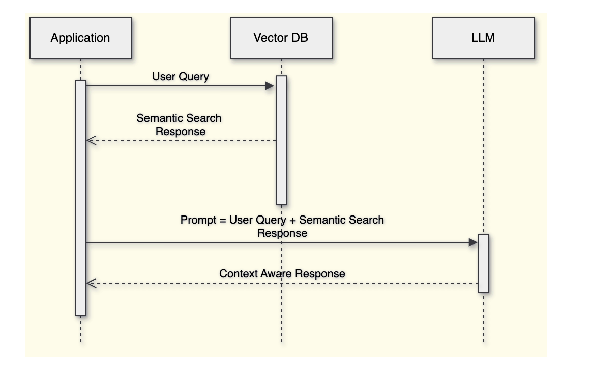

### RAG 란 ?

Rag 를 알기 전 먼저 LLM에 대해 알아야 합니다. LLM 이란 Large Language Model(대규모 언어 모델)의 약자입니다.  이는 대량의 텍스트 데이터를 학습해 자연어를 이해하고 생성할 수 있는 인공지능 모델을 의미합니다. 대표적인 LLM으로는 OpenAI의 GPT 시리즈, Google Gemini ai, Claude 등이 있습니다. 

RAG는 **Retrieval-Augmented Generation**의 약자입니다. 이는 LLM과 **정보 검색** 기술을 결합한 자연어 처리(NLP) 기법입니다. RAG는 LLM이 학습한 지식뿐만 아니라 외부 데이터 소스(예: 웹 문서, 기업 내부 문서) 에서 정보를 검색해 그 정보를 바탕으로 정확한 답변을 생성하는 방식입니다.

간단히 말해 RAG는 언어 모델이 자체적으로 모든 답을 생성하는 대신 필요한 경우 관련된 정보를 검색해 답변의 정확성을 높이는 기법입니다.

정리해서 RAG가 동작하는 방식은 다음과 같습니다. 

1. 사용자가 질문을 입력합니다.
2. RAG는 외부 데이터 소스에서 질문과 관련된 정보를 검색합니다.
3. 검색된 정보를 기반으로 LLM이 답변을 생성합니다.

### RAG 동작 원리 알아보기

RAG 의 동작 원리는 다음과 같습니다. 이 과정은 임베딩 모델과 벡터 데이터베이스(Vector Database)를 이용해 비정형 데이터(문서, 이미지 등)와 사용자의 질문을 연결하는 방법을 서술한 것 입니다. 

</img>

1. **외부 데이터 소스 임베딩 및 저장**

- **데이터 임베딩(Embedding)**: 사용자가 제공한 외부 데이터 소스는 텍스트로 되어 있습니다. 이 텍스트를 임베딩 모델에 넣어 각 텍스트의 의미를 벡터화 시킵니다.
- **벡터 저장**: 변환된 벡터는 벡터 데이터베이스에 저장됩니다. 벡터 데이터베이스는 벡터 간의 유사도를 빠르게 계산할 수 있는 구조로 설계되어 있습니다. 이를 통해 데이터 소스에 있는 문서들이 의미에 따라 분류되어 저장되며 이후 유사한 벡터를 쉽게 검색할 수 있습니다.

2. **사용자 질문 처리 및 임베딩 변환**

- **프롬프트 임베딩**: 사용자가 질문(프롬프트)을 입력하면 이 질문 역시 임베딩 모델을 거쳐 벡터로 변환됩니다. 즉 질문 또한 벡터화 시킵니다. 이 벡터는 임베딩 모델이 학습한 의미 공간 내에서 어떠한 위치를 가집니다.
- **유사도 계산**: 변환된 질문 벡터는 벡터 데이터베이스에 있는 저장된 문서 벡터들과 비교됩니다. 벡터 데이터베이스는 질문 벡터와 가장 유사한 벡터를 빠르게 찾기 위해 **코사인 유사도** 또는 **유클리드 거리**등을 계산하여 벡터 간의 유사성을 평가합니다.

3. **가장 유사한 데이터 추출**

- **상위 N개 결과 추출**: 유사도 계산 결과를 바탕으로 벡터 데이터베이스는 질문과 가장 유사한 문서 벡터 상위 N**개**를 반환합니다. 이 과정은 유사도를 기준으로 순위가 매겨지며 상위에 위치한 벡터는 질문과 의미적으로 가장 가까운 값입니다.

4. **LLM에게 답변 요청**

- **프롬프트 생성**: 사용자 질문과 벡터 데이터베이스에서 추출된 상위 N개의 문서 데이터를 결합하여 **LLM에 대한 프롬프트**를 생성합니다. 이 프롬프트는 사용자 질문과 함께, 관련된 문서에서 추출된 정보를 포함하는 형태로 구성됩니다.
- **LLM에 요청**: 생성된 프롬프트를 LLM(Large Language Model, 예: GPT-4 등)에 전달합니다. LLM은 이 프롬프트를 기반으로 문맥에 맞는 답변을 생성합니다. LLM은 입력된 텍스트를 이해하고 주어진 문서와 질문의 내용을 결합하여 최적의 답변을 생성합니다.

그렇다면 RAG 를 구축해서 업무에도 사용해 볼 수 도 있지 않을까요 .. ? 

```jsx
- Kotlin Code Convetion 문서 를 이용한 코드리뷰
- CS 대응 (“FAQ 매뉴얼”)
- Slack bot 제작 ("연차 신청 방법이 뭐였지?”)
```
다음 시간에는 RAG를 직접 구축하여 LLM Model 에 답변까지 받아보겠습니다.