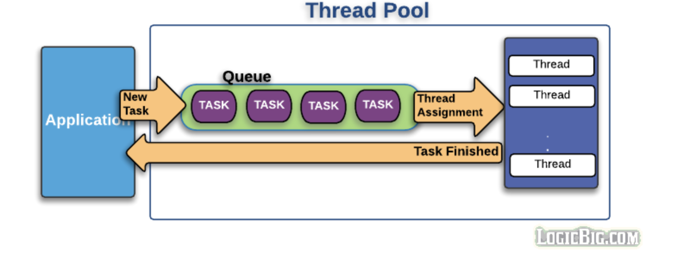
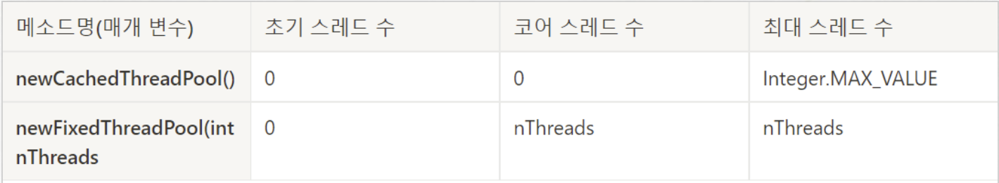
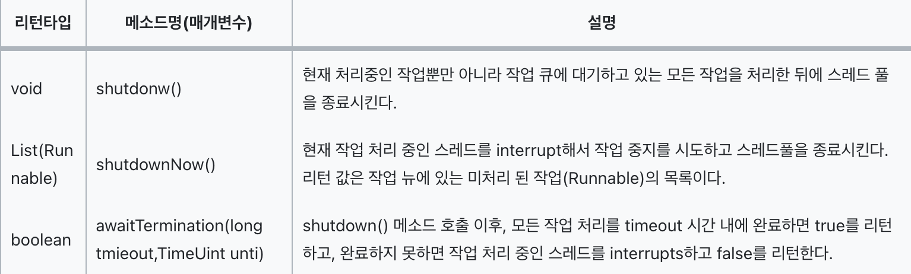

# Thread pool

### 스레드 풀 ?

서버는 동시에 많은 요청이 몰릴 수 있습니다. 많은 요청이 있을 때 마다 무한정 OS에 스레드를 만들어 달라고 요청하여 해당 요청들을 처리한다면 어떻게 될까요 ? 

```kotlin
1. 메모리 부족 
		-> 스레드는 생성될 때마다 메모리가 할당됩니다. 각 스레드는 스택 메모리 & 운영체제 리소스를 소비합니다. 
2. 스레드 스케줄링 비용 증가 
		-> 스레드 수가 적으면 비용이 크지 않지만, 스레드 수가 증가할수록 스케줄링의 오버헤드가 급격히 증가합니다.
3. CPU 사용률 증가로 인한 스레드 경쟁 
		-> CPU는 한정된 코어 수만큼만 동시 실행이 가능하며, 나머지 스레드는 대기상태에 놓입니다.
		   결국 각 스레드가 충분한 실행시간을 확보하지 못하고, 지연이 발생되어 집니다. 
```

그렇다면 이러한 문제를 어떻게 처리할 수 있을까요? 에 대한 해결책으로 스레드 풀 이란 개념이 나왔습니다. 

스레드풀 이란 서버구동 시 해당 서버에서 사용할 스레드를 미리 생성해두고 요청이 들어올때 마다 해당 스레드를 할당해주는 기술 입니다. 

하지만 직관적 으로 생각해 보았을 때 1000개의 요청에 대해 1000개의 스레드를 생성하는 것이 아닌 10개의 생성되어진 스레드풀 에서의 스레드를 할당하여 요청을 처리하는 것이 빠르진 않을것 같은데 .. ? 메모리상 이점은 가져갈 수 있으나 과연 속도까지 빠를까 ? 

```kotlin
1. 과도한 스레드 생성은 오히려 성능 저하를 가져옵니다.
		-> 스레드 스케줄링 및 컨텔스트 스위칭 비용이 급격하게 증가하여 성능 저하를 초래합니다.
		-> 스레드가 많아질수록 스케줄링 작업이 늘어나고, 컨텍스트 스위칭이 자주 발생하여 CPU 시간이 실제 
			 작업이 아닌 스레드 관리에 더 크게 소모되어 집니다. 
	  -> 컨텍스트 스위칭 비용은 스레드가 많아질수록 급격하게 증가합니다. 
2. I/O 바운드 작업에서 비효율적인 대기 시간이 나타납니다.
		-> 많은 I/O 바운드 작업(파일읽기, 네트워크 요청)이라면, 스레드가 많은 시간을 대기상태로 보내게 
			 되는데, 이 경우 실제 CPU를 사용하는 시간보다 외부 작업을 기다리는 시간이 더 길어집니다. 
			 
*** 왜 CPU 바운드 작업에서는 일어나지 않는 비효율적인 대기 시간이 I/O 바운드 에서는 나타날까? *** 
I/O 바운드 작업은 외부 장치와의 의존성 때문에 대기시간이 일어나게 됩니다.얘를 들어, 파일을 읽거나 네트워크
요청을 보낼때, CPU는 네트워크 응답이나 데이터를 읽는 작업시간 동안 대기합니다. 이동안 CPU 는 대기상태에 
빠지게 됩니다. 반면 CPU 바운드 작업은 복잡한 계산이나 데이터 처리와 같은 모든 과정을 직접 CPU 자체에서
끊임없이 하기떄문에 대기 상태로 들어갈 이유가 거의 없습니다. 
```

### 스레드 풀 동작 원리 

</img>

1. 요청이 들어오면 core size 만큼 스레드를 생성합니다. 
2. 요청이 들어올 때 마다 Task Queue 에 적재합니다. 
3. core size만큼 생성되어진 스레드 중, 유휴상태(idle)인 스레드가 있다면 Tasks Queue에서 Task를 꺼내 스레드에 할당하여 작업을 처리합니다. 
    
    ```kotlin
    스레드의 상태 값
    - 유휴 상태 (idle) : 작업을 기다리고 있는 상태입니다.
    - 실행중 (running) : 현재 작업을 처리하고 있는 상태입니다.
    - 차단됨 (blocked) : I/O 작업이나 동기화 작업 등으로 인해 일시적으로 실행이 중단되어진 상태입니다.
    - 종료 (turminated) : 작업을 완료하고 종료된 상태입니다.
    - 신규 (new) : 스레드가 생성되었지만 아직 실행되지 않은 상태입니다. 
    - 대기 (waiting) : 다른 스레드의 작업이 끝나기를 기다리는 상태입니다. 
    - 일시정지 (suspend) : 외부 요인에 의해 일시적으로 실행이 중단된 상태입니다. 
    
    *** 유휴상태와 대기상태 모두 기다린다는 상태값인데 2가지의 차이는 무엇일까? *** 
    유휴상태는 새로운 작업을 받을 준비가 되어있는 상태 즉 스레드 풀에서 새 작업을 즉시 할당받을 수 있는
    상태입니다. 하지만 대기상태는 스레드가 특정 조건이 충족되어지기를 기다리는 상태 즉 다른 스레드의 작업 
    완료, 리소스 획득, 외부 이벤트 등을 기다리며, 현재 작업을 일시적으로 중단했지만, 조건이 충족되면 
    자동으로 재개되어지는 상태입니다. 
    
    **유휴상태는 바로 가용할 수 있는 상태, 대기상태는 특정 조건이 충족될때까지 가용할 수 없는 상태입니다** 
    ```
    
    3-1. 만약 유휴상태인 스레드가 없다면 Task는 Task Qeueu에서 대기합니다. 
    
    3-2. 그 상태가 지속되어 Task Queue가 꽉 찬다면 스레드를 새로 생성합니다.
    
    3-3. 3번의 과정을 반복하다 스레드 max size에 도달하고 Task Queue도 꽉 차게 되면 추가로 들어오는 요       청에 대해서는 connection-refused 오류를 반환합니다. 
    
4. Task가 완료되어지면 스레드는 다시 유휴상태로 돌아가게 됩니다. 
    
    4-1. Task Queue가 비어있고 core size이상의 스레드가 생성되어 있다면 스레드를 destory 합니다.
    

### ExecutorService

자바에서는 java.util.concurrent 패키지에서 스레드풀을 사용할 수 있도록 ExecutorService 인터페이스를 제공합니다.

> **스레드풀 생성**
> 

ExecutorService의 구현객체는 Executors클래스의 2가지 메소드 중 하나를 이용해 생성할 수 있다.

</img>

- 초기 스레드 수: ExecutorService 객체가 사용될 때 기본적으로 생성되는 스레드 수
- 코어 스레드 수: 스레드 수가 증가된 후 사용되지 않는 스레드를 스레드 풀에서 제거할 때 최소한 유지해야할 스레드 수
- 최대 스레드 수: 스레드 풀에서 관리하는 최대 스레드 수

newCachedTreadPool() 메소드는 1개 이상의 스레드가 추가되었을 경우 60초 동안 스레드가 아무 작업을 하지 않으면 해당 스레드 풀에서 쫓아내지만, newFixedThreadPool 메소드는 스레드가 놀고 있어도 제재를 가하지 않습니다. 

> 스레드풀 종료
> 

스레드풀의 스레드는 기본적으로 main 스레드가 종료되더라도 작업을 처리하기 위해 계속 실행 상태로 남아있습니다. 따라서 어플리케이션을 종료하려면 스레드풀을 종료시켜 스레드풀이 종료 상태가 되도록 처리해 주어야 한다.

</img>

> 작업 생성
> 

- 작업은 Runnable or Callbale 구현 클래스로 표현 되어집니다.
- Runnable은 작업 완료 이후 리턴 값이 없지만, 후자는 리턴 값이 존재합니다.

```kotlin
Runnable {
    println("Runnable task is running")
} <- return 값 x 

------------------------------------------------------------------------------

val callableTask = Callable {
    println("Callable task is running")
    "Task result" 
} <-- return 값 O 

val executorService = Executors.newSingleThreadExecutor()
val futureResult = executorService.submit(callableTask)

val result = futureResult.get()  // "Task result" 출력
```

> 작업 처리 요청
> 

ExecutorService의 Task Queue에 Runnable or Callbale 객체를 넣는 행위로 정의되어집니다. 

해당 객체를 넣을 때 주로 **execute()** 와 **submit()** 메서드를 사용합니다. 두 메서드는 처리하는 방식에 있어 몇가지 중요한 차이점이 있습니다. 

1. **execute() 메서드** 
    - Runnable 작업을 스레드 풀에 제출합니다.
    - Runnbble 객체 이기에 작업에 대한 결과를 반환하지 않습니다.
    - 작업 도중 예외가 발생하면, 해당 스레드는 종료되어지고, 스레드풀에서 제거 되어집니다. 이로 인해 추가적인 작업을 처리할 스레드를 다시 생성해야 하기에 추가적인 오버헤드가 발생합니다.
2. **submit()** 메서드 
    - Runnable or Callble 작업 모두 스레드 풀에 제출할 수 있습니다.
    - 완료되어진 작업은 Future 객체로 변환되어 반환되어 집니다.
    - Future객체로 변환되어 반환되어지기에 리턴값이 존재 합니다. ( Runnable 객체는 반환값이 없기에 null 이 리턴되어 집니다. )
    - 작업도중 예외가 발생해도, 해당 스레드는 종료되지 않고 재사용 되어집니다. 스레드 풀은 예외 발생 여부와 상관없이 해당 스레드를 유지하며, 오버헤드 없이 바로 다음 작업을 진행할 수 있습니다.

**스레드 오버헤드를 줄이기 위해** 가급적이면 submit을 사용하는 것이 더 바람직합니다. submit은 작업 실패 후에도 **스레드를 재사용**하므로, 스레드 생성 비용을 절약할 수 있습니다.