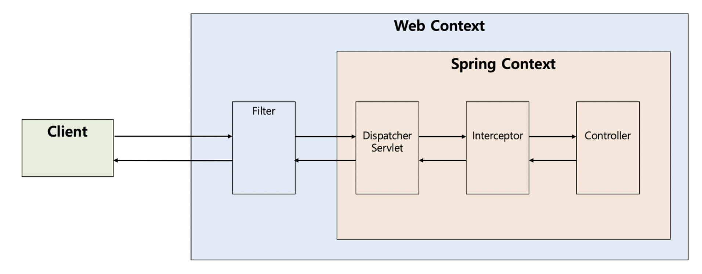

# AOP 란 무엇일까요 ? 

> `AOP` (Aspect-Oriented Programming, 관점 지향 프로그래밍) 방식은`핵심 관심사`(Core Concerns)와 `횡단 관심사`(Cross-cutting Concerns)을 분리하여 가독성과 모듈성을 증진시킬 수 있는 프로그래밍 패러다임
> 

예를 들어보겠습니다. 개발자 철수는 API 앞 뒤에 공통적인 기능을 추가( 소요 시간측정, 로깅 등등 ) 하려 합니다. 기능에는 유저, 결제, 주문 .. 등등의 기능들이 존재합니다.  그렇다면 아래와 같은 방식으로 코드를 작성할 것 입니다. 

- 유저 + 로깅, 소요시간 측정
- 결제 + 로깅, 소요시간 측정
- 주문 + 로깅, 소요시간 측정

같은 코드가 3개인 도메인에 섞여 들어가게 됩니다. 하지만 이것을 스프링에서 제공하는 AOP 로 처리한다면 ? 

common() 이란 메소드를 따로 만들어놓고, annotation으로 등록한 후 @Common 이란 어노테이션만 유저, 결제, 주문 메소드 위에 해당 어노테이션만 붙이면 동작합니다. 그럼 기존 코드에서 관심사가 분리 되어지니 유지보수 하기가 쉬워질 것 입니다. 

### 그렇다면 Filter, Interceptor, AOP 의 차이는 무엇일까요 ?

AOP 는 위에서 본 것과 같이 공통 관심사를 분리 시키는 것입니다. 이해하기 쉽게 AOP 라는 컨셉에 종류가 Filter, Interceptor 입니다. 더 들어가 Filter와 Interceptor의 차이는 Spring Context 밖에서 동작하고, 안에서 동작하는 것의 차이 입니다. 

### Spring Context 안과 밖?

Client 에서 Spring으로 Http Request를 보내게 된다면 

Client → Web Server → WAS → Spring 의 순서로 API 요청이 오게 될 것 입니다. 

</img>

Spring Context 밖에서 동작 한다는 것은 Web Context 에서 동작한다는 것 입니다. Filter는 Spring Context 밖에서 동작 합니다. Interceptor는 Spring Context안에서 동작합니다. 즉 Spring 까지 가기 전에 Servlet단에서 지지고 볶는 단계가 Filter, Filter 거친 후 Http Request 가 Dispatcher Servlet 에게 보내져서 url 에 맵핑된 controller에게 보내기 이전의 작업이 Interceptor에서 일어나는 것 입니다.  

### Filter

Filter 는 3가지 메소드를 구현해야만 합니다. 

```kotlin
public interface Filter {

    public default void init(FilterConfig filterConfig) throws ServletException {}

    public void doFilter(ServletRequest request, ServletResponse response,
            FilterChain chain) throws IOException, ServletException;

    public default void destroy() {}
}
```

- init 메소드
    - init 메소드는 필터 객체를 초기화하고 서비스에 추가하기 위한 메소드이다. 웹 컨테이너가 1회 init 메소드를 호출하여 필터 객체를 초기화하면 이후의 요청들은 doFilter를 통해 처리된다.
- doFilter 메소드
    - doFilter ****메서드는 필터의 핵심 메서드로, 요청이 들어올 때마다 실행됩니다.
    - 요청이 필터에 도달하면 doFilter 메서드가 실행되어, 요청을 처리하거나 다음 대상(서블릿, 다른 필터 등)으로 요청을 전달합니다.
    - 요청/응답을 가로채 원하는 작업을 추가할 수 있는 메서드입니다.
- destory 메소드
    - 필터 객체가 제거될 때 호출되는 메서드입니다.
    - 필터가 사용하던 리소스(예: 데이터베이스 연결, 스레드 등)를 정리하거나 반환할 때 사용됩니다.
    - 웹 컨테이너(톰캣 등)가 필요에 따라 이 메서드를 호출합니다.

정리 

- doFilter 메소드: 요청/응답을 가로채 원하는 작업을 추가하거나, 요청을 다음 대상으로 전달하는 메서드입니다. 주로 요청 전/후에 추가 작업(로그 기록, 인증, 변환 등)을 수행합니다.
- destory 메소드: 필터 객체가 제거될 때 호출되어, 사용하던 리소스를 정리합니다. 필터 생명주기의 종료를 담당합니다.

# Interceptor

Interceptor 또한 3가지 메소드를 구현해야 합니다. 

```kotlin
public interface HandlerInterceptor {

    default boolean preHandle(HttpServletRequest request, HttpServletResponse response, Object handler)
        throws Exception {
        
        return true;
    }

    default void postHandle(HttpServletRequest request, HttpServletResponse response, Object handler,
        @Nullable ModelAndView modelAndView) throws Exception {
    }

    default void afterCompletion(HttpServletRequest request, HttpServletResponse response, Object handler,
        @Nullable Exception ex) throws Exception {
    }
}
```

- preHandle 메소드
    - preHandle 메소드는 컨트롤러가 실행되기 전에 실행되는 메서드입니다.
    - 요청(Request)이 컨트롤러에 도달하기 전에 전처리 작업을 수행합니다.
        - 사용자가 로그인여부
        - 요청 데이터를 가공
        - 권한 체크
- postHandle 메소드
    - postHandle ****메소드는 컨트롤러 실행 후에 호출됩니다.
    - 컨트롤러가 처리한 결과(ModelAndView 등)에 후처리 작업을 추가할 수 있습니다.
        - 컨트롤러 반환값 수정
        - 응답 데이터 가공
    - 단 예외 발생 시 호출 되어지지 안습니다.
    - 최근 RestAPI 방식에서는 사용하지 않습니다. ( @ResrController와 같은 )
        
        ```kotlin
        - postHandle 은 컨트롤러가 HTML 뷰를 반환할 때 유용했지만, Rest API와 JSON 응답이 주류가 되면서 사용 빈도가 줄어들었습니다.
        - 대체 기술
            - JSON 응답 처리:  ResponseBodyAdvice
            - 전역 작업 처리: Filter, AOP
            - 예외 발생 시 작업: afterCompletion
        
        결론: 오늘날의 Rest API 중심 개발에서는 `postHandle` 대신 더 적합한 대안이 사용되고 있습니다.
        ```
        
- afterCompletion 메소드
    - afterCompletion은 요청 처리와 응답 처리가 완전히 끝난 후 호출됩니다.
    - 예외가 발생하더라도 무조건 실행됩니다.
        - 데이터 베이스 연결, 파일 핸들러 등 닫아야할 때
        - 요청이 시작되고 끝남을 기록
        - 에러처리

정리 

- preHandle: 컨트롤러 실행 전에 요청을 검사하거나 수정.
- postHandle: 컨트롤러 실행 후 결과 데이터를 가공.
- afterCompletion: 모든 작업이 끝난 뒤 리소스 정리 및 에러 처리.

# Filter, Intercepor 모두 AOP 인데 왜 나눴지?

Filter는 Spring Context 바깥에 위치 합니다. 근데 Spring Context에서 Java 객체를 Bean으로 등록하여 사용 합니다. 따라서 Filter에서는 Spring Bean을 사용하지 못합니다. 그럼에도 불구하고 Filter를 따로 떨어뜨린 이유는 그 앞 단에서 Http Request를 보낸 클라이언트가 해커는 아닌지, XSS 공격을 하는지, CORS 정책을 잘 따르며 보냈는지 먼저 Filter에서 거르고 Spring Context 안으로 보내기 위함 입니다. 

Interceptor는 Filter에서 걸러져서 들어온 요청이 회원 가입에 관한 요청이라고 했을 때, 컨트롤러에서 회원가입 메소드에서 파라미터로 userRequest를 받는데 필드 값이, username, password 라고 할 때 해당 필드 값을 검증 한다던지, 필드 값이 이상하면 Exception을 던지는 것과 같은 역할을 합니다. 

# Filter에서 Bean을 쓰지 못한다

DelegatingFilterProxy 가 등장하면서 위의 문장은 옳지 못합니다. 기존 Filter는 서블릿이 제공하는 기술이므로 서블릿 컨테이너에 의해 생성되며 서블릿 컨테이너에 등록이 되었습니다. 그렇기 때문에 스프링의 빈으로 등록도 불가능 했으며, 빈을 주입 받을 수 없었습니다. 하지만 Filter에서도 DI와 같은 스프링 기술을 필요로 하는 상황이 나오면서 DelegatingFilterProxy가 등장하게 되었습니다. 

하지만 Spring boot 가 등장하게 되면서 DelegatingFilterProxy는 필요 없게 되었습니다. Spring boot에서는 내장 웹서버를 지원 하면서 톰캣과 같은 서블릿 컨테이너 까지 Spring boot가 제어가 가능해졌기 때문입니다. 

결론적으로 Spring boot 는 필터를 Spring Bean으로 등록하면 자동으로 서블릿 컨테이너에 연결해주게 되었으며 이를 통해 별도의 DelegatingFilterProxy 없이도 Spring에서 관리되는 필터를 사용할 수 있습니다.