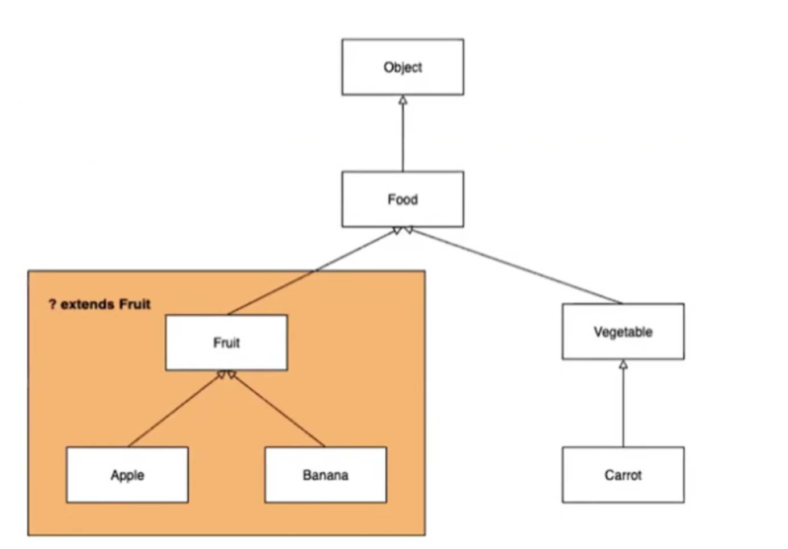
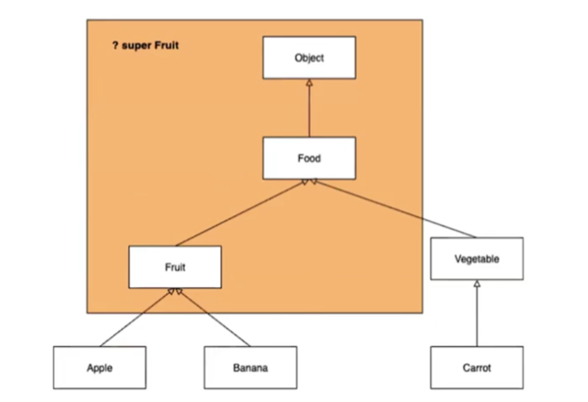

# 제네릭 

```kotlin
public static <T extends Comparable<? super T>> List<T> sorted(List<T> list) { ... }  
```

이건 머체 어떤 코드일까요 .. ? ㄷㄷ 제네릭에 대해 알아보겠습니다. 

제네릭이란 무엇일까요 ? 

> 클래스 내부에서 사용할 데이터 타입을 외부에서 지정하는 기법
> 

이라고 할 수 있습니다. 즉 **클래스를 정의할 때 특정 데이터 타입에 의존하지 않고, 다양한 타입에 대해 유연하게 동작할 수 있도록 만드는 방법**이라고 할 수 있습니다.

```kotlin
ArrayList[]**<String>** list = new ArrayList<>(10); 
```

위의 코드와 같이 꺽쇠 괄호 키워드를 사용하는 것 이 제네릭을 만드는 방법인데, 꺽쇠 안에 타입을 지정하는 것이 마치 메소드에서의 매개변수를 넘기는 것 과 비슷하여 이를 타입 매개변수 혹은 타입 변수라고 불리워 집니다. 

예를 들어 보겟습니다. 아래와 같은 코드가 제네릭을 사용하여 정의한 클래스 입니다. ( 작성 by. 우진님 ) 

```kotlin
data class Response<T>(
    private val code: String,
    val message: String = "",
    private val data: T?,
    private val key: String,
    private val params: Array<Any>? = emptyArray(),
) { ... }
```

클래스명 옆에 <T>를 사용하여 제네릭을 붙여준 것을 볼 수 있습니다. 이를 인스턴스화를 해본다면 ?? 

```kotlin
val stringResponse = Response<String>(
        code = "200",
        message = "Success",
        data = "This is a string response",
        key = "stringKey"
  )

val intResponse = Response<Int>(
    code = "200",
    message = "Success",
    data = 123,
    key = "intKey"
)

val listResponse = Response<List<String>>(
    code = "200",
    message = "Success",
    data = listOf("Item1", "Item2", "Item3"),
    key = "listKey"
)

val mapResponse = Response<Map<String, Int>>(
    code = "200",
    message = "Success",
    data = mapOf("key1" to 1, "key2" to 2),
    key = "mapKey"
)
```

마치 파라미터를 지정해서 보내는 것 처럼 생성 코드에 꺽쇠 안에서 개발자가 지정하고 싶은 타입을 지정하여 작성해 준다면, 제네릭 클래스의 선언 부분에 가서 타입 매개변수 T가 지정된 타입이 해당 타입으로 모두 변환되어 클래스의 타입이 지정되어지게 됩니다. 이를 제네릭의 **타입 전파**라고 합니다. 

하지만 지정할 수 있는 타입은 Reference 타입 뿐 입니다. int, double 과 같은 원시타입은 제네릭의 타입으로 지정할 수 없습니다. 그렇다면 원시타입으로 제네릭을 지정할 수 없는 이유는 무엇일까요 ? 

이는 Type Erasure 때문입니다. Java에서는 제네릭이 도입되기 전의 코드와의 호환성을 유지하기 위해, 타입 소거(Type Erasure)라는 개념을 사용합니다. 타입 소거는 컴파일 시점에 **제네릭 타입 정보가 제거**되고, 런타임에서는 **Object 또는 경계(bound) 타입으로 대체**되는 방식을 의미합니다. 이로 인해 컴파일된 코드에서는 제네릭 타입 정보가 남지 않게 됩니다.

원시 타입(`int`, `double`, `char` 등)은 **참조 타입이 아닌 값 타입**으로, `Object`로 변환될 수 없습니다. 제네릭 타입은 컴파일 시 타입 소거가 발생해 **모든 타입이 참조 타입인 `Object`로 처리되거나, 경계(bound)에 따라 변환**됩니다. 그러나 원시 타입은 **객체가 아니기 때문에 `Object`로 변환될 수 없으므로** 제네릭 타입으로 사용할 수 없습니다.

정리하자면 원시 타입은 객체가 아니므로 **Object로 처리되는 제네릭의 특성과 호환되지 않기 때문**입니다. 이를 해결하기 위해 Java에서는 **래퍼 클래스와 오토박싱/언박싱**을 제공하여 제네릭에서도 원시 타입을 간접적으로 사용할 수 있게 해줍니다.

다시 돌아가서 Reference 타입이 모두 가능하다는 것은 개발자가 작성한 class 또한 지정하여 작성할 수 있다는 뜻입니다. 자바, 코틀린은 객체지향 언어입니다. 클래스간 상속을 통해 관계를 맺는 객체지향의 다형성 또한 적용이 될 수 있다는 뜻입니다. 

```kotlin
class Fruit { }
class Apple extends Fruit { }
class Banana extends Fruit { }

class FruitBox<T> {
    List<T> fruits = new ArrayList<>();

    public void add(T fruit) {
        fruits.add(fruit);
    }
}

public class Main {
    public static void main(String[] args) {
        FruitBox<Fruit> box = new FruitBox<>();
        
        box.add(new Fruit());
        box.add(new Apple());
        box.add(new Banana());
    }
}
```

그렇다면 제네릭을 사용했을 때 어떤 점을 이점으로 가져올 수  있을까요 ? 

컴파일 단계에서 타입 체킹을 통해 런타임 에러를 방지할 수 있습니다. 

- 제네릭은 jdk 1.5 버전에서 추가되었습니다. jdk 1.5 이전에는 여러 타입을 다루기 위해 인수나 반환 값으로 자바 객체의 최 상단 부모 객체인 Object 타입을 사용하였습니다. 하지만 Object로 타입을 선언할 경우 반환되어진 Object 타입을 다시 코드 단계에서 원하는 타입으로 형 변환을 시켜줘야 했기에 귀찮음 + 잘못된 형 변환을 했을 시 런타임 에러가 발생할 수 있었습니다.

킹치만 또 이러한 좋은점 만 있을까요 ? 는 아니겠죠 

제네릭을 사용하는 장점에서 나와있듯이 제네릭을 사용하면 코드 작성자는 자유롭게 외부에서 타입을 지정하여 넣어줄 수 있습니다. 여기서 이 “자유롭다“가 문제입니다. 

예를 들어보겠습니다. 여기 계산기 클래스가 있습니다. 

```kotlin
class Calculator<T> {
    void add(T a, T b) {}
    void min(T a, T b) {}
    void mul(T a, T b) {}
    void div(T a, T b) {}
}

public class Main {
    public static void main(String[] args) {
        Calculator<Number> cal1 = new Calculator<>();
        Calculator<Object> cal2 = new Calculator<>();
        Calculator<String> cal3 = new Calculator<>();
        Calculator<Main> cal4 = new Calculator<>();
    }
}
```

코드 작성자의 의도는 타입 매개변수로 Number 타입만을 넘어오는 것을 의도하고 코드를 작성했지만, 제가 심술이 나서 Object, String 과 같은 Reference Type을 넘긴다면 ?? ㄷㄷ 

이와 같은 심술을 막기위해 **제한된 타입 매개변수 라는 개념이 나왔습니다.** 

기본적인 용법은 <T extends [제한타입]> 입니다. <T> 에 extends 라는 키워드를 붙여줌으로써, <T extends Number> 제네릭을 Number 클래스와 그 하위타입 들만 받도록 타입 매개변수의 범위를 제한 한 것입니다. 

또한 제네릭은 제네릭 간의 형변환 문제가 존재합니다. Java의 제네릭은 타입 안정성을 위해 설계되었기 때문에, 제네릭 타입이 다르면 상속 관계가 있어도 형변환이 불가능합니다. 예를 들어, 다음과 같은 상황을 보겠습니다.

```kotlin
List<Number> numbers = new ArrayList<>();
List<Integer> integers = new ArrayList<>();
numbers = integers; // 컴파일 오류!
```

여기서 Integer는 Number의 서브클래스이지만, List<Number>와 List<Integer> 는 서로 다른 제네릭 타입으로 간주되기 때문에 형변환이 불가능합니다. 이는 **제네릭 타입이 서로 다른 타입 매개변수를 갖는 경우 상속 관계를 갖지 않도록 제한**하기 때문입니다. 이 문제를 제네릭의 와일드 카드란 키워드로 풀었는데 와일드 카드를 알기 전에 변성에 대한 개념을 알아야합니다. 

공변성 과 반공변성 합쳐서 변성이라고 합니다. 변성이란 타입의 상속 계층관계에서 서로 다른 타입 간에 어떤 관계가 있는지를 나타내는 지표입니다. 그리고 공변성은 서로 다른 타입간에 함께 변할 수 있다는 특징을 이야기합니다. 이를 OOP 에서는 리스코프 치환 원칙 이라고 부릅니다. 


```
공변: S 가 T의 하위 타입이면

- S[]는 T[]의 하위 타입이다.
- List<S>는 List<T>의 하위 타입이다.

반공변: S 가 T의 하위 타입이면

- T[]는 S[]의 하위 타입이다. ( 공변의 반대 )
- List<T> 는 List<T>의 하위 타입이다. ( 공변의 반대 )

무공변 혹은 불공변: S와 T는 서로 관계가 없다.

- List<S> 와 List<T>는 서로 다른 타입이다.
```

코드로 본다면 ? 

```kotlin
// 공변성
Object[] Covariance = new Integer[10];

// 공변성
ArrayList<Object> Covariance = new ArrayList<Integer>();

// 반공변성
ArrayList<Integer> Contravariance = new ArrayList<Object>();
```

제네릭 예시 코드는 자바에서는 동작하지 않습니다. 이유는 자바는 일반적으로 제네릭 타입에 대해 공변/반공변을 지원하지 않기 때문입니다. 즉 자바의 제네릭은 무공변의 성질을 지닙니다. 

위에서 작성 하였듯이 타입 매개변수 간에는 상속 관계란 개념이 통하지만 아래와 같이 타입간 캐스팅은 불가능합니다. 왜냐하면 제네릭은 무공변의 성질을 지니고 있기 때문입니다. 제네릭은 타입매개 변수로 전달받은 그 타입에 한정해서만 캐스팅이 가능합니다. 

```kotlin
ArrayList<Object> parent = new ArrayList<>();
ArrayList<Integer> child = new ArrayList<>();

parent = child; // 업캐스팅 불가
child = parent; // 다운캐스팅 불가
```

그렇다면 공변성 이란 것이 없다면 나타나는 문제는 무엇일까요 ? 아래 코드를 살펴봅니다. 

```kotlin
public static void print(Object[] arr) {
    for (Object e : arr) {
        System.out.println(e);
    }
}

public static void main(String[] args) {
    Integer[] integers = {1, 2, 3};
    print(integers);
}

------------------------------------------------------------------

public static void print(List<Object> arr) {
    for (Object e : arr) {
        System.out.println(e);
    }
}

public static void main(String[] args) {
    List<Integer> integers = Arrays.asList(1, 2, 3);
    print(integers); 
}
```


리스트안의 int 형의 값들을 반복문을 돌며 프린트를 찍는 코드입니다. 위의 코드는 정상 동작을 할 것이고 아래의 코드는 컴파일 에러가 날것입니다. 위의 코드는 자동으로 Int 타입이 Object 타입으로 업캐스팅 되어 문제 없이 동작하지만 공변성을 지원하지 않는 제네릭은 오로지 같은 타입만 받기에 동작하지 못합니다. 그렇다면 외부로부터 값을 받는 타입 매개변수의 타입을 Integer 로 고정하여 작성해주어야 하는데 그럼 제네릭을 쓰는 이유가 사라집니다. ( 나는 Long도 Double 도 받고싶기 때문에.. ) 

이러한 문제를 해결하기 위해 나온 것이 와일드 카드 입니다. 아래 코드에 작성되어진 ? 가 와일드 카드 입니다. 

```kotlin
  default Comparator<T> thenComparing(Comparator<? super T> other) {
      Objects.requireNonNull(other);
      return (Comparator<T> & Serializable) (c1, c2) -> {
          int res = compare(c1, c2);
          return (res != 0) ? res : other.compare(c1, c2);
      };
  }
```

? 가 들어가면 어떤 타입이든 다 받겠다 라는 뜻입니다. 근데 그러면 그냥 Object 로써 받는거와 크게 다를것이 없잖아요 ? 따라서 타입 한정 연산자와 같이 쓰이게 됩니다. 타입 한정 연산자에 extends, super 두가지가 존재합니다. 이 2가지 키워드만 쓰잖아요 ? 그럼 자바에서 지원하지 않는 변성 이란 개념을 장착할 수 있습니다. 

```
<? extends T>, <? super T> 와일드카드를 이용하면 공변, 반공변이 적용되도록 설정할 수 있습니다. 이 2가지를 정리하자면 다음과 같습니다.

- 상한 경계 와일드카드 <? extends T>: 공변성 장착
- 하한 경계 와일드카드 <? super T>:  반공변성 장착
```
상한 경계와 하한 경계를 그림으로 보면 아래와 같습니다. 
</img>

</img>
아까 문제가 되었던 코드를 위의 개념을 이용하여 정상 동작하게 바꿔보겠습니다. 

```kotlin
// 공변 
public static void printCovariant(List<? extends Number> arr) {
    for (Number e : arr) { // arr의 요소는 Number로 취급 가능
        System.out.println(e);
    }
}

public static void main(String[] args) {
    List<Integer> integers = Arrays.asList(1, 2, 3);
    printCovariant(integers); // 허용됨 (List<Integer>는 List<? extends Number>의 하위 타입)
}

-------------------------------------------------------------------------------
// 반공변
public static void printContravariant(List<? super Integer> arr) {
    for (Object e : arr) { // arr의 요소는 Object로 취급 가능
        System.out.println(e);
    }
}

public static void main(String[] args) {
    List<Object> objects = Arrays.asList(1, "string", 3.0);
    printContravariant(objects); // 허용됨 (List<Object>는 List<? super Integer>와 호환)
}
```

킹데 어떨때 super 를 사용하고 어떨때 extends 를 사용해아 할까요 .. ? Effective Java 에서 제시한 공식이 존재합니다. PECS 라는 공식입니다. PECS 란 Producer-Extends / Consumer-Super 라는 단어의 약자로써, 외부에서 온 데이터를 생산 해야한다면 <? extends T>를 사용( 하위타입으로 제한 ) 외부에서 온 데이터를 소비 한다면 < ? super T > 를 사용 ( 상위타입으로 제한 ) 정리하자면 

- 외부에서 온 데이터를 생산(Producer) 한다면 <? extends T> 를 사용 (하위타입으로 제한)
- 외부에서 온 데이터를 소비(Consumer) 한다면 <? super T> 를 사용 (상위타입으로 제한)

```kotlin
class MyArrayList<T> {
    Object[] element = new Object[5];
    int index = 0;

    // 외부로부터 리스트를 받아와 매개변수의 모든 요소를 내부 배열에 추가하여 인스턴스화 하는 생성자
    public MyArrayList(Collection<? extends T> in) {
        for (T elem : in) {
            element[index++] = elem;
        }
    }

    // 외부로부터 리스트를 받아와 내부 배열의 요소를 모두 매개변수에 추가해주는 메서드
    public void clone(Collection<? super T> out) {
        for (Object elem : element) {
            out.add((T) elem);
        }
    }
}
```

외부에서 온 데이터를 매개변수에 담아 for문으로 순회하여 MyArrayList를 인스턴스화(생성)하는 생산자(Producer) 역할을 하고 있다고 말할 수 있다. 외부에서 리스트를 받아 요소를 복사하여 적재하는 clone 메서드의 매개변수에는 super 와일드카드 키워드가 쓰였다. 즉, MyArrayList의 내부 배열을 소비하여 매개변수 리스트에 적재하는 행위를 하고 있다고 볼 수 있는 것이다.